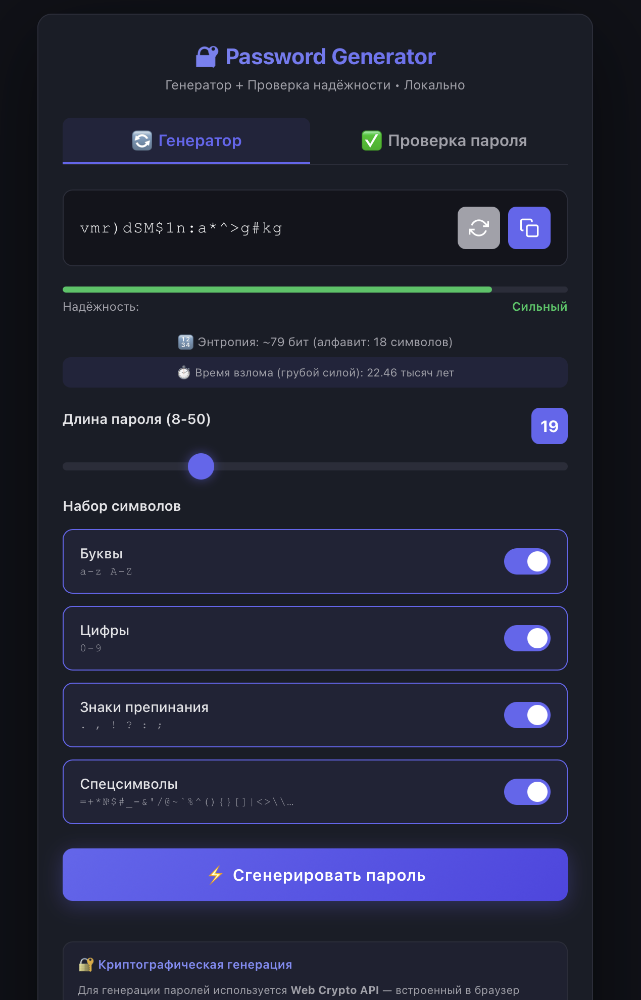

# Password-generator
Криптографический генератор паролей с проверкой надёжности. Все операции локально, без серверов.


# 🔐 Password Generator

[](https://opensource.org/licenses/MIT)
[](https://www.javascript.com/)
[](https://developer.mozilla.org/en-US/docs/Web/API/Web_Crypto_API)

**Криптографический генератор паролей с проверкой надёжности. Все операции выполняются локально на вашем устройстве — никакие данные не передаются на серверы.**

## 🖼️ Внешний вид



*Тёмная тема, адаптивный дизайн, индикатор надёжности*

## ✨ Особенности

- 🔐 **Криптографическая генерация** — используется Web Crypto API (CSPRNG)
- 🏠 **Полная локальность** — все операции на вашем устройстве, без интернета
- 📊 **Проверка надёжности** — анализ любого пароля (4-150 символов)
- ⏱️ **Время взлома** — расчёт стойкости к перебору (brute force)
- 🎨 **Современный интерфейс** — тёмная тема, адаптивный дизайн
- 📋 **Один клик** — копирование пароля в буфер обмена
- 🔢 **Длина пароля** — от 8 до 50 символов
- 🔠 **4 набора символов** — буквы, цифры, знаки препинания, спецсимволы

## 🚀 Демо

Просто откройте файл `index.html` в любом современном браузере. Никаких серверов, сборок или зависимостей!

## 📥 Установка и использование

### Локальное использование

1. **Скачайте файл** `index.html`
2. **Откройте** в браузере (Chrome, Firefox, Safari, Edge)
3. **Генерируйте** пароли и проверяйте их надёжность

### Запуск из репозитория

```bash
git clone https://github.com/ВАШ_НИК/password-generator.git
cd password-generator
# Открыть index.html в браузере
# Или использовать live-server для удобства:
npx live-server
```

Использование в вебе

Можно разместить на GitHub Pages, Netlify, Vercel или любом другом хостинге статических файлов.

🛡️ Безопасность

· ✅ Web Crypto API — криптостойкий генератор случайных чисел
· ✅ Локальная энтропия — сбор случайности от движений мыши и нажатий клавиш
· ✅ Нет телеметрии — никаких запросов к серверам
· ✅ Нет логирования — пароли не сохраняются нигде

📊 Расчёт надёжности

Энтропия рассчитывается по формуле:

```
E = L × log₂(N)
```

где:

· L — длина пароля
· N — количество уникальных символов в пароле

Таблица оценки надёжности

Энтропия (бит)   Оценка   Пример пароля
< 28   Очень слабый   qwerty
28-36   Слабый   pass123
36-50   Средний   MyDogRex2020
50-65   Хороший   k7#2mP!9qR
65-80   Сильный   X#mP9$kL2@nQ4
 > 80   Очень сильный   T#8kLp$2mN@9qR&5vX

🖥️ Браузеры

Поддерживаются все современные браузеры с Web Crypto API:

· Chrome/Edge 80+
· Firefox 75+
· Safari 13+
· Opera 67+

📁 Структура проекта

```
password-generator/
├── index.html          # Единственный файл (HTML, CSS, JS)
└── README.md          # Документация
```

## 💝 Финансовая поддержка

💳 Реквизиты для финансовой поддержки:
Поддержите разработку, если проект сэкономил вам время или повысил безопасность!
  

🔹 USDT (Polygon) — Рекомендуется (низкая комиссия)

0x0100CAB59D16b9f5C68f88132F27b295c84560Fe

🔹 USDT (Arbitrum)

0x0100CAB59D16b9f5C68f88132F27b295c84560Fe

🔹 USDT (Ethereum / ERC-20) — Высокая комиссия!

0x0100CAB59D16b9f5C68f88132F27b295c84560Fe

🔹 BTC

bc1qfdtjg8ls3lva9tx7vrzxy3m8mlpvdlvp2am8lk

🔹Ethereym(ETH)

0x02f2c8075ba6a8EFDffdBAcF6E958bC905017C74 

🔹Monero(SPL)

Fx1VEfgZqqqbFV3TfYwrrjrmXuoSkwaWJQAcAr341hr5

🔹Ethereym Classic(ETC)

0xf66Fc76daA8D9da7438e560F28B838c7aFdBCE36

⚠️ Внимание: Перед отправкой убедитесь, что вы выбрали правильную сеть/валюту. Ошибки в сети/валюте ведут к безвозвратной потере средств.

### Бесплатная поддержка:
⭐⭐⭐ **Просто поставьте звезду** — это уже большая помощь!


🤝 Вклад в проект

Pull request'ы приветствуются! Для больших изменений сначала откройте issue.

1. Форкните репозиторий
2. Создайте ветку (git checkout -b feature/AmazingFeature)
3. Коммитните изменения (git commit -m 'Add AmazingFeature')
4. Пуш в ветку (git push origin feature/AmazingFeature)
5. Откройте Pull Request

📝 TODO

· Добавить опцию "исключить похожие символы" (i, l, 1, O, 0)
· Экспорт/импорт настроек в JSON
· PWA для установки на устройство
· Поддержка генерации фраз (passphrases)
· i18n (английский, русский)

📄 Лицензия

Распространяется под лицензией MIT. Смотрите файл LICENSE для деталей.


🙏 Благодарности

· MDN Web Docs — за отличную документацию по Web Crypto API
· Entropy Bits Calculator — за формулу расчёта энтропии

📧 Контакты

## 👤 Автор

**JDHKod**

- GitHub: [github.com/JDHKoD](https://github.com/JDHKoD)


**Для вопросов и предложений** — создавайте [Issue](https://github.com/JDHKoD/password-generator/issues)


---

⭐ Поставьте звезду, если вам полезен этот проект!

🔒 Ваша безопасность — наша главная цель. Всё работает локально, никаких серверов, никакой слежки.

